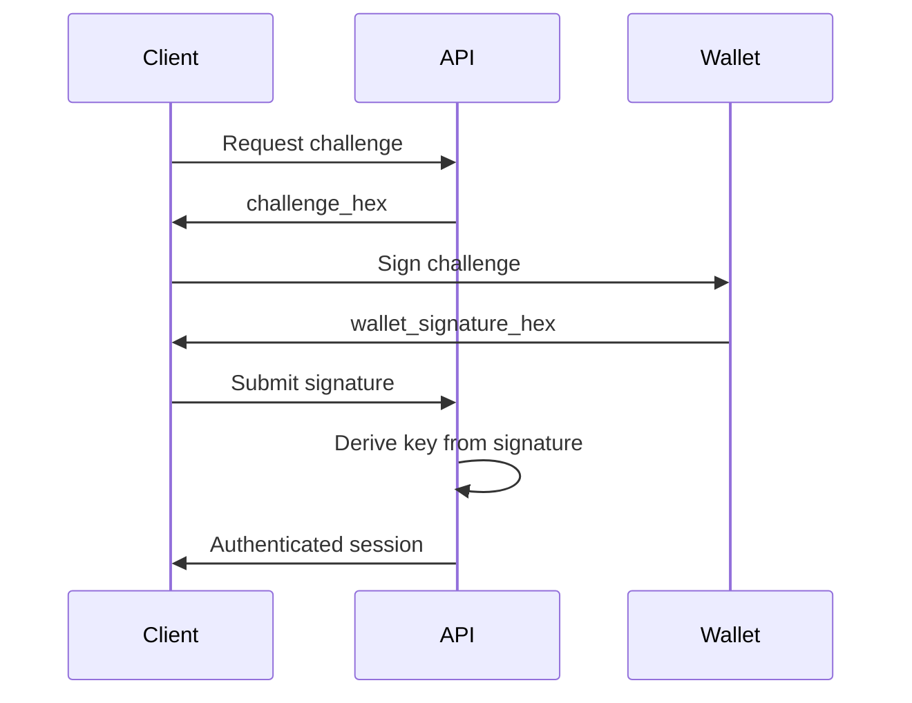

# API Documentation

**Base URL:** `http://localhost:8000` (development)  
**Production URL:** TBD  
**API Version:** 1.0.0

---

## Overview

The Sovereign AI Context API provides endpoints for:
- User provisioning (minting context tokens)
- Session management (wallet-signature authentication)
- Vault operations (encrypted context storage)
- AI chat completions (multi-model support)

### Authentication

**Method:** Wallet signature challenge-response

All authenticated endpoints require a valid wallet signature proving ownership of a context token.

### Rate Limiting

- **Development:** No rate limits
- **Production:** 100 requests/minute per IP (planned)

---

## Authentication Flow

### Challenge-Response Mechanism



**Challenge Format:**
```python
challenge = b"sovereign-ai-context-challenge-" + token_id.encode("utf-8")
```

**Signature Requirements:**
- 64 bytes (Ed25519) or 65 bytes (secp256k1)
- Hex-encoded string in requests

---

## Endpoints

### User Provisioning

#### POST /user/provision/start

Mint a new context token and return signing challenge.

**Request:**
```json
{
  "account_id": "0.0.123456",
  "companion_name": "MyAI"
}
```

**Response:**
```json
{
  "token_id": "0.0.67890",
  "challenge_hex": "736f7665726569676e2d61692d636f6e746578742d6368616c6c656e67652d302e302e3637383930",
  "expires_at": "2026-04-02T01:00:00Z"
}
```

**Status Codes:**
- `200` - Success
- `400` - Invalid account_id format
- `502` - Hedera network error

---

#### POST /user/provision/complete

Complete provisioning by submitting wallet signature.

**Request:**
```json
{
  "token_id": "0.0.67890",
  "wallet_signature_hex": "abc123..."
}
```

**Response:**
```json
{
  "token_id": "0.0.67890",
  "status": "provisioned",
  "vault_sections": ["soul", "user", "symbiote", "session_state"],
  "index_file_id": "0.0.12345"
}
```

**Status Codes:**
- `200` - Success
- `400` - Invalid signature format
- `404` - No pending provision found
- `502` - Hedera network error

---

#### GET /user/{token_id}/status

Check if a context token is provisioned.

**Response:**
```json
{
  "token_id": "0.0.67890",
  "is_provisioned": true,
  "index_file_id": "0.0.12345",
  "created_at": "2026-04-02T00:00:00Z"
}
```

**Status Codes:**
- `200` - Success
- `404` - Token not found

---

### Session Management

#### POST /session/open

Open a new session with wallet signature.

**Request:**
```json
{
  "token_id": "0.0.67890",
  "wallet_signature_hex": "abc123..."
}
```

**Response:**
```json
{
  "session_id": "sess_abc123",
  "token_id": "0.0.67890",
  "vault_sections": {
    "soul": "# Harness Core\n...",
    "user": "# User Profile\n...",
    "symbiote": "# AI Configuration\n...",
    "session_state": "# Session State\n..."
  },
  "expires_at": "2026-04-02T04:00:00Z"
}
```

**Status Codes:**
- `200` - Success
- `400` - Invalid signature
- `401` - Signature verification failed
- `404` - Token not provisioned
- `502` - Hedera network error

---

#### POST /session/close

Close session and save updated vault.

**Request:**
```json
{
  "session_id": "sess_abc123",
  "updated_sections": {
    "session_state": "# Session State\n\nUpdated content..."
  }
}
```

**Response:**
```json
{
  "session_id": "sess_abc123",
  "status": "closed",
  "sections_updated": ["session_state"],
  "duration_seconds": 3600
}
```

**Status Codes:**
- `200` - Success
- `404` - Session not found
- `502` - Hedera network error

---

#### GET /session/status

Get current session status.

**Query Parameters:**
- `session_id` - Session identifier

**Response:**
```json
{
  "session_id": "sess_abc123",
  "status": "active",
  "token_id": "0.0.67890",
  "opened_at": "2026-04-02T00:00:00Z",
  "expires_at": "2026-04-02T04:00:00Z"
}
```

**Status Codes:**
- `200` - Success
- `404` - Session not found

---

### Vault Operations

#### GET /vault/sections

List all vault sections for a session.

**Query Parameters:**
- `session_id` - Session identifier

**Response:**
```json
{
  "sections": [
    {
      "name": "soul",
      "size_bytes": 1024,
      "last_updated": "2026-04-02T00:00:00Z"
    },
    {
      "name": "user",
      "size_bytes": 2048,
      "last_updated": "2026-04-02T00:00:00Z"
    }
  ]
}
```

**Status Codes:**
- `200` - Success
- `401` - Unauthorized
- `404` - Session not found

---

#### PUT /vault/sections/{name}

Update a vault section.

**Request:**
```json
{
  "session_id": "sess_abc123",
  "content": "# Updated Content\n\nNew section content..."
}
```

**Response:**
```json
{
  "section_name": "soul",
  "status": "updated",
  "size_bytes": 1536,
  "updated_at": "2026-04-02T00:30:00Z"
}
```

**Status Codes:**
- `200` - Success
- `400` - Invalid content
- `401` - Unauthorized
- `404` - Section not found

---

#### DELETE /vault/sections/{name}

Delete a vault section.

**Query Parameters:**
- `session_id` - Session identifier

**Response:**
```json
{
  "section_name": "old_section",
  "status": "deleted",
  "deleted_at": "2026-04-02T00:30:00Z"
}
```

**Status Codes:**
- `200` - Success
- `401` - Unauthorized
- `404` - Section not found

---

### Chat / AI

#### POST /chat/completions

Send a chat completion request to AI models.

**Request:**
```json
{
  "session_id": "sess_abc123",
  "model": "claude-3-5-sonnet-20241022",
  "messages": [
    {
      "role": "user",
      "content": "What's in my vault?"
    }
  ],
  "temperature": 0.7,
  "max_tokens": 1000
}
```

**Response:**
```json
{
  "id": "chatcmpl_abc123",
  "model": "claude-3-5-sonnet-20241022",
  "choices": [
    {
      "message": {
        "role": "assistant",
        "content": "Based on your vault, you have..."
      },
      "finish_reason": "stop"
    }
  ],
  "usage": {
    "prompt_tokens": 150,
    "completion_tokens": 50,
    "total_tokens": 200
  }
}
```

**Status Codes:**
- `200` - Success
- `400` - Invalid model or parameters
- `401` - Unauthorized
- `429` - Rate limit exceeded
- `502` - AI provider error

---

#### GET /chat/models

List available AI models.

**Response:**
```json
{
  "models": [
    {
      "id": "claude-3-5-sonnet-20241022",
      "provider": "anthropic",
      "context_window": 200000
    },
    {
      "id": "gpt-4o",
      "provider": "openai",
      "context_window": 128000
    },
    {
      "id": "gemini-1.5-pro",
      "provider": "google",
      "context_window": 1000000
    }
  ]
}
```

**Status Codes:**
- `200` - Success

---

## Error Responses

All errors follow this format:

```json
{
  "error": {
    "code": "invalid_signature",
    "message": "Wallet signature verification failed",
    "details": {
      "expected_length": 64,
      "actual_length": 32
    }
  }
}
```

### Common Error Codes

| Code | HTTP Status | Description |
|------|-------------|-------------|
| `invalid_request` | 400 | Malformed request body |
| `invalid_signature` | 400 | Signature format invalid |
| `unauthorized` | 401 | Signature verification failed |
| `not_found` | 404 | Resource not found |
| `rate_limit_exceeded` | 429 | Too many requests |
| `hedera_error` | 502 | Hedera network error |
| `ai_provider_error` | 502 | AI model provider error |

---

## Rate Limits

**Development:** No limits

**Production (Planned):**
- 100 requests/minute per IP
- 1000 requests/hour per token_id
- 10 concurrent sessions per token_id

**Headers:**
```
X-RateLimit-Limit: 100
X-RateLimit-Remaining: 95
X-RateLimit-Reset: 1712034000
```

---

## Webhooks

**Status:** Not yet implemented

**Planned Events:**
- `vault.section.updated`
- `session.opened`
- `session.closed`
- `token.provisioned`

---

## SDKs

**Available:**
- Python: `pip install sovereign-ai-context` (planned)

**Planned:**
- JavaScript/TypeScript
- Go
- Rust

---

## Examples

### Complete Provisioning Flow

```python
import requests

# 1. Start provisioning
response = requests.post("http://localhost:8000/user/provision/start", json={
    "account_id": "0.0.123456",
    "companion_name": "MyAI"
})
data = response.json()
token_id = data["token_id"]
challenge_hex = data["challenge_hex"]

# 2. Sign challenge with wallet (pseudo-code)
wallet_signature_hex = wallet.sign(bytes.fromhex(challenge_hex)).hex()

# 3. Complete provisioning
response = requests.post("http://localhost:8000/user/provision/complete", json={
    "token_id": token_id,
    "wallet_signature_hex": wallet_signature_hex
})
print(response.json())
```

### Open Session and Chat

```python
# 1. Open session
response = requests.post("http://localhost:8000/session/open", json={
    "token_id": "0.0.67890",
    "wallet_signature_hex": wallet_signature_hex
})
session = response.json()
session_id = session["session_id"]

# 2. Send chat message
response = requests.post("http://localhost:8000/chat/completions", json={
    "session_id": session_id,
    "model": "claude-3-5-sonnet-20241022",
    "messages": [{"role": "user", "content": "Hello!"}]
})
print(response.json()["choices"][0]["message"]["content"])

# 3. Close session
requests.post("http://localhost:8000/session/close", json={
    "session_id": session_id,
    "updated_sections": {}
})
```

---

## Changelog

- **v1.0.0** (2026-04-02) - Initial API release
  - User provisioning endpoints
  - Session management
  - Vault operations
  - Chat completions

---

**Last Updated:** 2026-04-02  
**API Version:** 1.0.0
